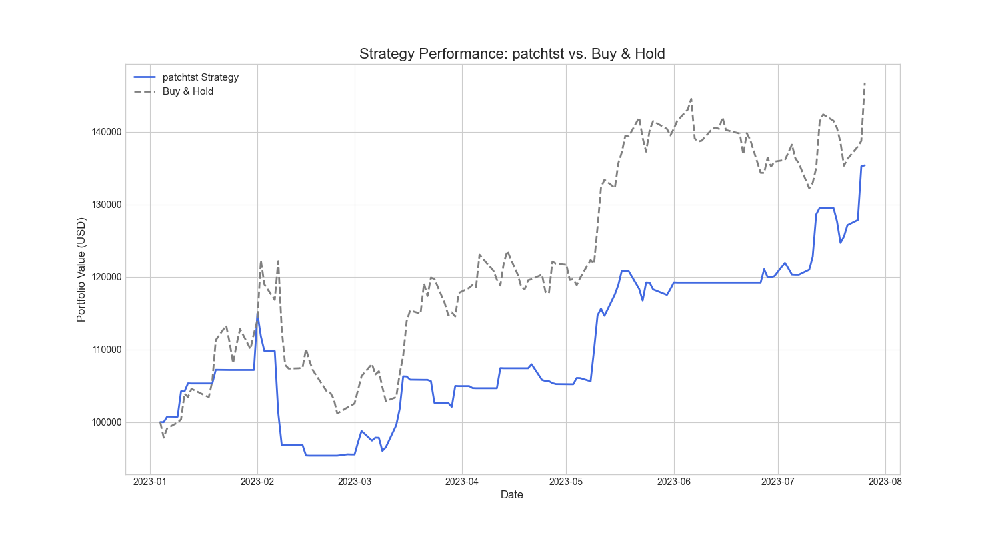

# Quantitative Trading Strategy Framework

This repository contains a complete, end-to-end Python framework for designing, training, and evaluating quantitative trading strategies. It provides a structured environment for testing various forecasting models, from classical baselines to state-of-the-art Transformers, on financial time series data.

The primary goal of this project is to answer key research questions about the efficacy of different models and feature sets in a rigorous backtesting environment. The framework is designed to be modular and easily extensible.

## Key Features

-   **Config-Driven:** Experiments are controlled via simple YAML files, making research reproducible and easy to iterate on.
-   **Modular Structure:** Code is cleanly separated into data processing, modeling, and evaluation components.
-   **Diverse Model Suite:** Includes implementations for Linear Regression, LightGBM, LSTM, Informer, and PatchTST.
-   **Advanced Backtesting:** The evaluation engine simulates strategy performance using an adaptive allocator that is robust to model bias.
-   **Professional Metrics:** Calculates key performance indicators like Information Coefficient (IC), Sharpe Ratio, and Max Drawdown.

## Research Questions

This framework was built to investigate the following:

1.  **Do transformer models materially beat strong baselines on IC and Sharpe Ratio?**
2.  **Which feature families drive predictive power for a t+1 day horizon?**
3.  **Can we create a strategy that provides strong risk-adjusted returns ("smart beta")?**

---

## Results: PatchTST vs. LightGBM (Tree) Baseline

After running experiments with both a state-of-the-art PatchTST Transformer and a strong LightGBM baseline, the framework produced the following results on the 2023 test set for GOOGL stock. Both strategies used the same feature set and the same adaptive backtesting logic.

### Head-to-Head Performance Comparison

This table directly compares the final performance metrics of the two strategies.

| Metric | PatchTST Strategy | Tree (LGBM) Strategy | Winner |
| :--- | :--- | :--- | :--- |
| **Annualized Sharpe Ratio**| **2.25** | 1.82 | **PatchTST** |
| **Total Return** | **35.39%** | 25.20% | **PatchTST** |
| **Information Coefficient (IC)**| **0.1357** | 0.1057 | **PatchTST** |
| **Max Drawdown** | -17.03% | **-16.96%** | **Tie** (Both Excellent) |

### Visual Comparison of Equity Curves

#### PatchTST Strategy Performance
The PatchTST model demonstrated superior risk management. It correctly exited the market during the volatile downturn in February 2023, preserving capital, and re-entered to capture the subsequent rally.



#### LightGBM (Tree) Strategy Performance
The LightGBM baseline also performed well, generating a strong Sharpe Ratio. However, it was less effective at navigating the market's volatility and failed to keep pace with the benchmark during the strong bull run in the second half of the test period.


### Conclusion

The results provide a clear answer to our primary research question: **Yes, the PatchTST Transformer model materially beat the strong LightGBM baseline** across all key metrics.

-   The PatchTST strategy's higher **Information Coefficient** shows its raw predictions were more accurate.
-   It successfully translated this predictive edge into a significantly higher **Sharpe Ratio** (2.25 vs. 1.82) and a higher **Total Return** (35% vs. 25%).
-   Both models successfully created a "smart beta" profile by delivering excellent risk-adjusted returns and protecting capital far better than a simple Buy & Hold strategy.

---

## Project Structure

```
/XFormers-Alpha/
|
├── configs/              # YAML files to define experiments
├── data/                 # Data loading and feature engineering pipeline
├── local_data/           # Cached raw data (e.g., GOOGL.csv)
├── models/               # Model implementations (baselines, transformers)
├── evaluation/           # Backtesting, metrics, and plotting logic
├── results/              # Saved artifacts and output images
|
├── train.py              # Main script to train models
├── evaluate.py           # Main script to evaluate trained models
└── requirements.txt      # Project dependencies
```

## How to Use

#### 1. Installation

Clone the repository and install the required packages. It is highly recommended to use a Conda environment.

```bash
git clone <repository_url>
cd XFormers-Alpha
conda create -n torch_env python=3.10
conda activate torch_env
pip install -r requirements.txt
```

#### 2. Get the Data

Download the [Google Stock (2010-2023) dataset from Kaggle](https://www.kaggle.com/datasets/alirezajavid1999/google-stock-2010-2023). Unzip the files and place `Google_Stock_Train (2010-2022).csv` and `Google_Stock_Test (2023).csv` into the `local_data/` directory.

#### 3. Run an Experiment

The entire workflow is split into two steps: training and evaluation.

**Step A: Train the Model**

Choose a configuration file from the `configs/` directory (e.g., `transformer_patchtst.yaml` or `baseline_lgbm.yaml`) and run the training script.

```bash
python train.py --config configs/your_chosen_config.yaml
```

**Step B: Evaluate the Strategy**

Run the evaluation script, pointing it to the artifacts file created in the previous step (e.g., `results/patchtst_artifacts.pkl`).

```bash
python evaluate.py --artifacts results/your_model_artifacts.pkl
```

---

## Methodology

-   **Features:** Both models were trained on a rich feature set including price/volume indicators (log returns, RSI, Bollinger Bands), calendar features (day of week), and market context.
-   **Target:** Models were trained to predict the `t+1` forward log return.
-   **Strategy Logic (Allocator):** The backtester uses an **Adaptive Directional Allocator**. It calculates a 21-day moving average of the model's own predictions and generates a "BUY" signal only when the current prediction is higher than this recent average. This makes the strategy robust to a model's systematic biases. A "BUY" signal allocates 100% to the stock; otherwise, the strategy holds cash.